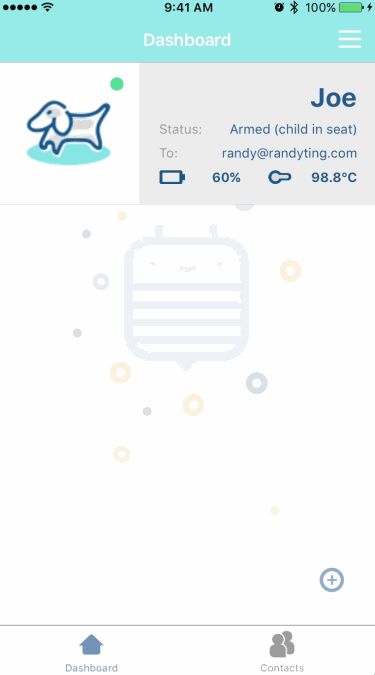

## Bumbl Car Seat Monitor iOS App

[Bumbl Baby Car Seat Monitor Product Page](http://www.bumblbaby.com/carsensor)

The Bumble Car Seat Monintor is an internet connected low energy proximity sensor.  It aims to tackle the problem of infants accidentally left in vehicles unattended.  The iOS app communicates over BLE with the monitor to detect the presence of a baby.  If an infant is left in his/her carseat, and a parent walks out of range of the vehicle, the app will alert the parent and provide an opportunity for the parent to acknowledge being alerted or notify emergency contacts of the location of the baby during the alert.

### Features

- [x] Major Features
   - [x] Background BLE connection and monitoring of sensor values.
   - [x] Cloud user login/logout.
   - [x] Cloud storage of sensor data.
   - [x] Cloud logging of sensor events and values.
- [] Dashboard
   - [x] Displays user-customizable avatar.
   - [x] Displays connection and presence status of baby.
   - [ ] Displays temperature from monitor's temperature sensor.
   - [ ] Displays current battery level.
- [x] Sensor Detail View
   - [x] Placeholder map view for last known location of sensor.
   - [x] "Tare" button for calibrating sensor

### Walkthroughs

Credits
---------
* [Parse](http://parseplatform.org/)
* [Firebase](https://firebase.google.com/)
* [Fabric](https://get.fabric.io/)
